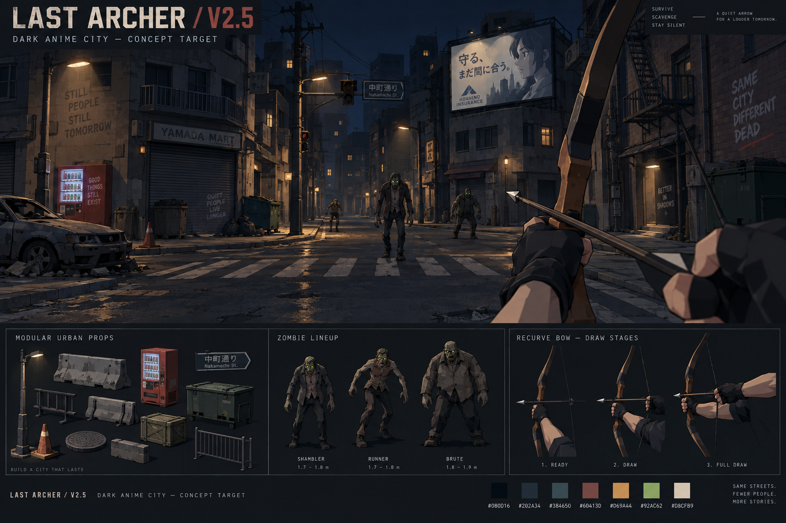

# Last Archer V2.5 — Dark Anime City

Stage 1 design proposal • awaiting visual direction review • 2026-09-18

## The target

A deserted city at night, with angular anime characters, crisp cel shading and believable first-person archery. Buildings form streets and alleys. Warm lamps pick out safe routes; olive-skinned zombies emerge from cool shadows. Keep the existing survival game and humorous environmental sponsors.

This is generated concept art, not a screenshot or a promise of rendering performance. Use its composition, silhouette, darkness and palette. Simplify the many small scratches, bricks, rubble pieces and reflections in production. The generated lettering is placeholder creative; retain the game's configured sponsor copy. The concept's bow diagrams are illustrative, not mechanical blueprints.

## Visual rules

- **Night with readable targets.** Shadowed building faces stay dark navy/charcoal. Ground edges, zombie faces and weapon silhouettes remain distinguishable at ordinary screen brightness.
- **Anime through shape and shading.** Angular jawlines, hair clumps, purposeful clothing folds, clean silhouettes and two or three shade bands. Flat shading alone is insufficient.
- **A connected city.** Three-to-five-storey facades meet sidewalks; shops have entrances, windows and shutters. Alleys and crosswalks form routes. Repeated modules share scale and floor heights.
- **Restrained accents.** Amber lighting dominates; olive green identifies enemies. Use one small cool sign accent per view. Reserve the brightest flashes for combat feedback.
- **Crisp edges.** Thin contours on characters and major prop silhouettes. Avoid outlining every brick or triangle. Keep bloom off for the first prototype and avoid blur, film grain and heavy vignette.
- **Functional advertising.** Place signs on supported posts, walls, shelters and vending machines. Buildings dominate the skyline; advertisements remain readable when approached and do not block aiming.

### Palette

These are display/sRGB art swatches, not calibrated Three.js light values.

| Role | Hex | Use |
|---|---|---|
| Night sky / deep shadow | `#080D16` | Sky, distant recesses |
| Charcoal | `#202A34` | Asphalt, main wall shadow |
| Blue gray | `#384650` | Concrete lit planes, metal |
| Muted brick | `#60413D` | Selected storefronts, roofs |
| Amber | `#D69A4A` | Lamps, bow accents, small UI highlights |
| Sickly olive | `#92AC62` | Zombie skin highlights; subdued in shadow |
| Warm cream | `#D8CFB9` | Sign text, arrow feathers, HUD |

Red remains available for damage feedback. Avoid full-screen exposure changes that make every surface gray. Compare images from the same camera, viewport, scene and lighting preset when tuning color.

## First playable art sample

Build a roughly 32 × 32 metre intersection with two short street approaches and one alley. Road width 8–10 m; sidewalk width 1.8–2.4 m; storey height around 3 m. One fully styled corner storefront establishes the quality target; other facades can initially be simple modules.

Include one sedan, one vending machine, dumpster, supply crate, barricade, supported billboard and two lamps. Reuse existing assets while establishing rendering. Keep the central route open, provide two loops around cover and leave clear spawn approaches. Add one 1.8 m shambler and a first-person bow prototype in their later stages. No rooftop traversal in the first sample.

Review three fixed views: intersection entrance, alley entrance and close-range enemy/bow view. Check desktop at 1440 × 900 and touch portrait at 390 × 844; also inspect landscape touch framing. Save identical before/after camera positions so random prop layouts do not hide regressions.

## Asset contracts

Keep the user's original lightweight asset specification. Higher budgets require a measured need and a separate decision; do not quietly increase them to match concept-art detail.

| Asset | Budget / format | Required detail |
|---|---|---|
| Props and environment modules | About 200–800 triangles each | Shape, major bevels, clear silhouette |
| Zombie | About 800–1,500 triangles each | Face, hair, clothing silhouette and rig |
| Bow and separate hand assets | Start within prop budgets; report assembled total | Limbs, grip, string, arrow, grip/draw poses |
| Textures | Usually none; at most 256 × 256 shared atlas per asset when needed | Flat colors, sparse painted detail |
| Delivery | One binary `.glb` per reusable asset | Embedded textures, meter scale, base-centre pivot |
| File size | Aim under 500 KB; 1 MB upper target | Record actual bytes; avoid duplicate images |

Use flat normals, no subdivision, no photorealistic maps. Prefer vertex colors plus one material or a small shared palette. Buildings should be modular; their assembled triangle count must be reported rather than disguised by counting only one wall. Runtime sponsor canvases are an explicit separate system: preserve readable text and centralized replaceable ad slots rather than baking text into the GLBs.

Deliver an editable `.blend` source plus individual GLBs and a manifest listing filename, purpose, dimensions, triangle count, materials, texture sizes, animations and bytes. Export a preview of each asset when practical.

**Coordinates:** Blender is Z-up; exported glTF/Three.js world is Y-up. Verify exports rather than assuming raw coordinates transfer. In game, placement is `{x, z, groundY}` and height is always explicit. For grounded props, transformed minimum Y should match the local surface within about 2 cm. Check intentional mounts such as wall posters against their parent surface instead. Apply transform updates before deriving world-space colliders. Draw temporary collider outlines during placement reviews.

## Zombies

The baseline uses camera-facing 2D sprites. Replace one shambler first; keep wave timing, enemy speed, damage and rewards stable while changing its representation.

| Type | Design | Animation character |
|---|---|---|
| Shambler — first implementation | Hunched adult, angular cheek/jaw, torn worker jacket, dull olive skin | Uneven steps, delayed shoulder sway |
| Runner — later | Lean build, cropped jacket, visibly different silhouette | Forward lean, rapid deliberate footfalls |
| Brute — later | Broad torso and thick forearms, 1.8–1.9 m | Weight transfer and heavy recovery |

Use one shared humanoid rig where feasible. Required clips: idle, walk/run, attack, hit and death; export each character with its own clips. Keep walking in place and let gameplay move the actor so it does not slide or double its speed. Inspect feet, shoulder deformation and silhouette from front/side/back. Use modest eye accents and selective rim lighting; eyes should not become large glowing blobs.

Maintain separate visual mesh and collision volumes. Headshots are a later explicit mechanic change, tested independently from the visual replacement. Do not reduce the existing wave population to make the renderer appear faster: profile the actual maximum population and then choose instancing, culling or simpler distant models as needed.

## First-person bow

Use a believable recurve bow with a wrapped grip, slim limbs, visible string, arrow shaft, feathers and broadhead. It should look convincing through its proportions and action while sharing the anime materials of the world.

Default pose: left hand grips a slightly canted bow on the right side of the view; right hand draws near the cheek/camera. Keep the center aiming area clear. The arrow must point forward into the world, foreshortened toward the crosshair. The discarded V2.4 sideways arrow is not a valid starting pose.

Model the string endpoint attachments and nock as named attachment points. Draw moves the nock and right hand toward the camera; the string follows both limb tips, and the arrow remains on the rest. Full charge visibly bends the limbs slightly. Release briefly vibrates the string and recoils the bow, then nocks another arrow. Aim for a clear ready → drawing → held → release → re-nock sequence. Test cancellation, rapid taps, pause, restart and touch input. Preserve current charge timing initially.

Use a dedicated foreground scene/camera or equivalent controlled render pass, with proper depth testing between weapon parts. Clear depth between the world and foreground passes so walls cannot cut through hands. Do not disable depth testing on every weapon part; that produces incorrect self-overlap. Fit the weapon separately for portrait screens. Honor reduced-motion settings; apply small movement bob only when moving. Update transforms/geometry in place: never create new string meshes every frame.

World projectiles must agree with the reticle. Aim from the world camera toward a target, then launch the arrow from a plausible bow release point toward that target with intentional ballistic compensation if needed. Test near, medium and far distances, and cover beside the bow; the cosmetic foreground weapon must not permit shooting through a wall. Record any collision/ballistics change separately from the art change.

Start with the baseline world FOV. Compare a slightly narrower option only after bow composition works; a smaller FOV does not itself sharpen rendering. Weapon framing has its own setting.

## Three.js rendering approach

Start with the embedded r134 baseline and a small isolated renderer study. Avoid combining an engine migration, material conversion, map rebuild and weapon rewrite in one change.

1. Audit material and texture color handling. Label canvas color textures as sRGB, keep numerical/data textures linear, and preserve GLTFLoader's existing texture/color handling. Procedural hex colors must follow one consistent conversion policy. Avoid converting imported GLB colors twice. The previous output-encoding/tone-mapping change was not a complete color audit.
2. Render a matte gray cube, color swatches, one imported GLB and a sponsor sign under the same light. Compare before/after; verify deep shadows survive and sign backgrounds retain their intended colors.
3. Introduce a reusable cel material with two or three light bands. Preserve vertex colors, alpha cutouts and animation/skinning requirements. Prototype it on one mesh before applying globally.
4. Use cool ambient fill and one warm directional key. Tune both from fixed screenshots. Amber streetlamp pools can be simple decals/fake pools; avoid many shadow-casting point lights.
5. Trial selective silhouettes on the shambler/large props. Check seams, thin objects and distant flicker before choosing inverted-hull or screen-space outlines. Avoid a universal triangle wireframe look.
6. Add one tightly framed shadow map and inexpensive contact shadows. Test acne, detached shadows, bias and mobile cost. Low quality may use contact shadows alone.
7. Keep native antialiasing and a measured resolution cap. Begin near DPR 1.5 on mobile and 2 on desktop; these are starting choices, not fixed guarantees. Sharpen by maintaining clear edges and contrast, not by raising resolution indefinitely.

Treat bloom, wet reflections and dense atmospheric particles as optional later polish. For this stage, dark fog should connect the city to the sky without making nearby enemies disappear.

## Known baseline issues to address in controlled implementation

The restored source is commit `c4429ed`, with gameplay matching V2.3.1. The following are source findings, not fixes completed in Stage 1:

- `bus.position.set(-31,13,0)` puts the bus 13 m above ground. The likely intended street placement is `(-31,0,13)`.
- `gas.position.set(38,42,0)` puts the fuel stop 42 m above ground. The likely intended placement is `(38,0,42)`.
- The earlier floating-platform diagnosis was incorrect. Restore/retain intended platform traversal until a deliberate map replacement; fix the actual placement axes first.
- `solidLocal` calls `localToWorld` after moving groups; explicitly refresh world transforms before calculating collider coordinates and verify alignment.
- The discarded V2.4 weapon rebuilt string meshes every frame, lacked correct projectile perspective and used depth-disabled materials. Build a new constrained view model; do not transplant that implementation.

These checks belong in the renderer/placement study before expanding the map. Capture the actual offending geometry and corrected collider positions when implementing.

## Performance and validation

Targets are provisional until measured on the user's hardware: aim for 60 fps on the desktop test device and at least 30 fps on a representative phone. Record device, resolution, quality mode and visible enemy count with each result. Do not claim phone performance from a desktop resized viewport.

First-pass scene budgets: roughly 150k visible triangles on desktop, 75k on mobile, about 100 draw calls on desktop and 60 on mobile. Count all shadow and foreground passes; revise only from profiling. Use shared geometry/materials for repeated city modules. Keep high-resolution concept art outside the runtime asset bundle.

Pass checks: all assets load; no shader/runtime errors; no floating grounded props; colliders align; no bow clipping/self-overlap; shots reach the reticle's target; animation resources remain stable during sustained draws; save data, waves, upgrades, ads, pause and touch controls still work. Compare screenshots before changing more than one rendering variable group.

For the growing city, propose serving separate cached GLBs from the same site rather than base64-embedding everything. Keep the individual reusable GLB requirement and an optional portable package. Do this as a separate packaging decision, not as part of Stage 1.

## Delivery checkpoints and usage

Stage 1 ends with this proposal, one concept sheet, its saved prompt and a Stage 2 handoff. One built-in image-generation call was used; its interface did not expose a model selector. No paid external service setup is required for this proposal.

Use Blender plus reproducible Python exporters for 3D work, Three.js for integration, Git for isolation and browser screenshots/profiling for review. A live Blender connector is optional; scripts can generate and export assets without it. Image generation supplies references, not ready-to-use rigged GLBs. Figma is optional for a later HUD pass. Do not add new services before an actual need appears.

Next recommended model: **GPT-5.6 Terra, high reasoning**, for a bounded renderer/placement prototype. Use medium for repeatable asset work after the prototype is approved. Return to Astra for a difficult blocker or the final visual review. These are workflow recommendations, not a measured usage guarantee.

Keep work on `anime-city-v1`. The live `main` branch stays at the restored build. The user requested stage-by-stage reviews and model switches: stop after each agreed deliverable. Require the user's preview approval before merging or deploying the replacement.
